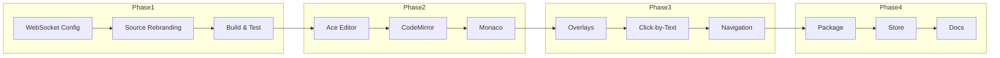

# ArqonMaestro Chrome Extension Implementation Plan

**Version:** 1.0  
**Status:** In Progress  
**Target:** Chrome Extension v2.0  

---

## Overview

This document outlines the implementation roadmap for the ArqonMaestro Chrome Extension v2.0. The plan is organized into phases with clear deliverables and dependencies.

---

## Current Status

The extension source code has been cloned from the Serenade repository and initial rebranding has been applied to:
- manifest.json
- package.json

### Completed Items

- [x] Clone repository from serenadeai/chrome
- [x] Update manifest.json with Arqon branding
- [x] Update package.json with Arqon branding
- [x] Add Arqon logo assets
- [x] Create mkdocs.yml for documentation

---

## Phase 1: Core Integration

**Duration:** 1 Week  
**Goal:** Connect to Arqon Bus endpoint used by ArqonMaestro

### Tasks

#### 1.1 WebSocket Configuration

- [x] Confirm `src/ipc.ts` WebSocket URL is `ws://localhost:9100/`
- [ ] Test connection to Arqon Bus backend
- [ ] Verify command routing works

#### 1.2 Source Code Rebranding

- [ ] Update all Serenade references in source code comments
- [ ] Update popup documentation link
- [ ] Update error messages

#### 1.3 Testing

- [ ] Build extension with `npm run build`
- [ ] Load extension in Chrome
- [ ] Verify connection to backend

**Deliverable:** Extension connects to Arqon Bus backend (`ws://localhost:9100/`)

---

## Phase 2: Editor Integration

**Duration:** 1 Week  
**Goal:** Verify web editor support

### Tasks

#### 2.1 Ace Editor Testing

- [ ] Test with Ace Editor instances
- [ ] Verify getEditorState works
- [ ] Verify setSourceAndCursor works

#### 2.2 CodeMirror Testing

- [ ] Test with CodeMirror instances
- [ ] Verify state synchronization
- [ ] Test undo/redo

#### 2.3 Monaco Editor Testing

- [ ] Test with Monaco Editor
- [ ] Verify model handling
- [ ] Test cursor positioning

**Deliverable:** All web editors work with ArqonMaestro

---

## Phase 3: Feature Parity

**Duration:** 1 Week  
**Goal:** Match existing Serenade features

### Tasks

#### 3.1 Overlay System

- [ ] Test link overlay display
- [ ] Test input overlay display
- [ ] Test number selection

#### 3.2 Click-by-Text

- [ ] Test single element click
- [ ] Test multiple element disambiguation
- [ ] Test XPath matching

#### 3.3 Navigation

- [ ] Test back/forward commands
- [ ] Test reload command
- [ ] Test scroll commands

**Deliverable:** All voice commands work correctly

---

## Phase 4: Polish & Deploy

**Duration:** 1 Week  
**Goal:** Finalize and release

### Tasks

#### 4.1 Build & Package

- [ ] Run production build
- [ ] Create distribution zip
- [ ] Test installed extension

#### 4.2 Chrome Web Store

- [ ] Prepare store listing
- [ ] Take screenshots
- [ ] Submit for review

#### 4.3 Documentation

- [ ] Update user guides
- [ ] Document voice commands
- [ ] Create troubleshooting guide

**Deliverable:** Extension published to Chrome Web Store

---

## Task Dependencies

---

## Technical Decisions

### 1. Manifest Version

**Decision:** Use Manifest V3

**Rationale:**
- Required for new Chrome extensions since 2023
- Service workers replace background pages
- Better performance and security

### 2. WebSocket Port

**Decision:** Use port 9100 (Arqon Bus default)

**Rationale:**
- Matches Arqon Bus local endpoint configuration
- Standard for Arqon ecosystem

### 3. Build Tool

**Decision:** Webpack 5

**Rationale:**
- Already configured in source
- Tree shaking support
- Hot reload capability

---

## Risks and Mitigations

| Risk | Impact | Mitigation |
|------|--------|------------|
| WebSocket disconnection | High | Auto-reconnect with backoff |
| SPA routing | Medium | Listen to history API |
| Dynamic content | Medium | Re-scan on visibility change |
| Extension update breaking changes | Low | Version compatibility checks |
| Chrome policy changes | Low | Follow best practices |

---

## Success Criteria

1. Extension installs from Chrome Web Store
2. WebSocket connects to Arqon Bus (`ws://localhost:9100/`) within 5 seconds
3. Voice toggle responds within 100ms
4. Overlay displays on pages with 100+ links
5. Navigation commands execute successfully
6. Click-by-text finds elements with 90% accuracy on common pages
7. All web editors (Ace, CodeMirror, Monaco) work correctly

---

## Related Documents

- [Technical Specification](./SPEC.md)
- [ArqonMaestro Main Documentation](https://novelbytelabs.github.io/ArqonMaestro/)

---

*Plan Version: 1.0*  
*Last Updated: 2026-03-10*
