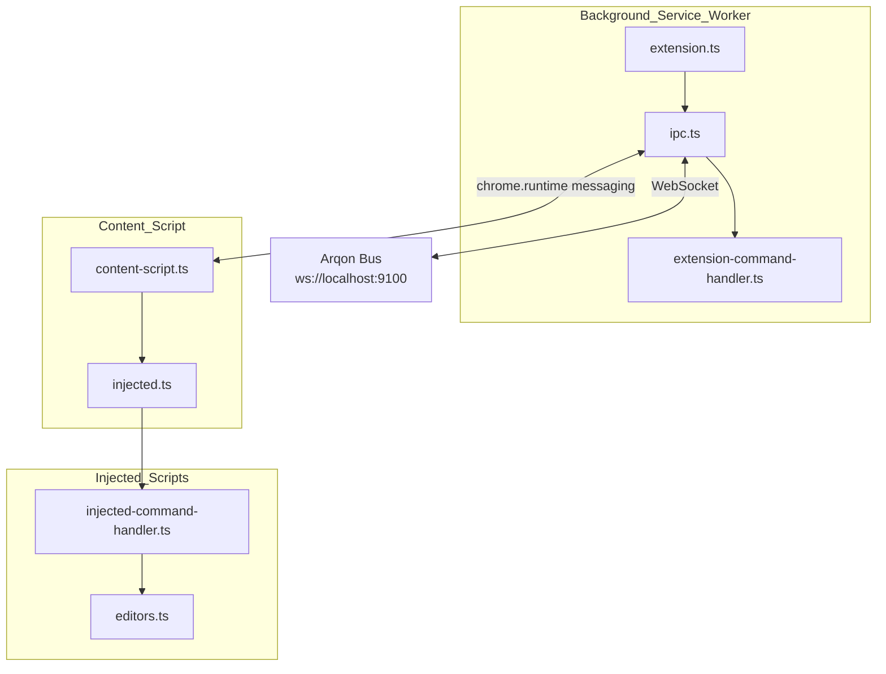

# ArqonMaestro Chrome Extension Technical Specification

**Version:** 2.0 (Rebrand from Serenade)  
**Status:** Phase 1 and Phase 2 Complete  
**Last Updated:** 2026-03-11

---

## 1. Executive Summary

This document provides the technical specification for the ArqonMaestro Chrome Extension v2.0. This is a major upgrade from the original Chrome extension baseline, including rebranding to ArqonMaestro and integration with Arqon Bus.

### 1.1 Goals

- Provide voice-controlled browser workflows for ArqonMaestro users
- Enable hands-free web navigation, form filling, and content interaction
- Integrate seamlessly with Arqon Bus via WebSocket
- Support web-based code editors (Ace, CodeMirror, Monaco)
- Keep port scope explicit: extension transport uses Arqon Bus (`9100`), not core stream (`17200/stream/`)

---

## 2. Architecture Overview

### 2.1 Component Architecture



### 2.2 File Structure

```
maestro-chrome-extension/
├── manifest.json              # Manifest V3
├── package.json              # Dependencies & build scripts
├── webpack.config.js        # Webpack configuration
├── tsconfig.json            # TypeScript config
├── src/
│   ├── extension.ts          # Background service worker entry
│   ├── ipc.ts               # WebSocket communication
│   ├── extension-command-handler.ts  # Browser API commands
│   ├── content-script.ts     # Content script entry
│   ├── injected.ts           # Injected script entry
│   ├── injected-command-handler.ts  # Page content commands
│   ├── editors.ts            # Editor integrations (Ace, CodeMirror, Monaco)
│   └── popup.ts              # Popup UI
├── img/
│   ├── icon_default/         # Connected state icons
│   └── icon_disconnected/   # Disconnected state icons
└── build/                   # Compiled output
```

---

## 3. Key Components

### 3.1 extension.ts (Background Service Worker)

- Entry point for the extension
- Manages WebSocket connection via IPC class
- Handles keep-alive for service worker
- Listens to browser events (tab activation, window focus, idle state)
- Public beta support target: Chrome-first

### 3.2 ipc.ts (Communication Layer)

- WebSocket client connecting to backend
- **URL:** `ws://localhost:9100/`
- Routes commands between background and content scripts
- Manages connection state
- Updates toolbar icon based on connection status

### 3.3 extension-command-handler.ts (Browser API Commands)

Handles commands that require browser API access:
- `COMMAND_TYPE_CLOSE_TAB` - Close current tab
- `COMMAND_TYPE_CREATE_TAB` - Create new tab
- `COMMAND_TYPE_DUPLICATE_TAB` - Duplicate current tab
- `COMMAND_TYPE_NEXT_TAB` - Switch to next tab
- `COMMAND_TYPE_PREVIOUS_TAB` - Switch to previous tab
- `COMMAND_TYPE_SWITCH_TAB` - Switch to specific tab by index
- `COMMAND_TYPE_RELOAD` - Reload current tab

### 3.4 injected-command-handler.ts (Page Content Commands)

Handles commands that interact with page content. For the public beta, the production-supported subset is:
- **Navigation**: `COMMAND_TYPE_BACK`, `COMMAND_TYPE_FORWARD`
- **Overlays**: `COMMAND_TYPE_SHOW` - Show links/inputs/code overlays
- **Overlay selection**: `COMMAND_TYPE_USE`, `COMMAND_TYPE_CANCEL`

Additional injected-page commands still exist for compatibility and experimental paths, but they are not part of the public beta contract.

### 3.5 editors.ts (Editor Integrations)

Supports multiple web-based code editors:
- **Ace Editor** - Full implementation
- **CodeMirror** - Full implementation  
- **Monaco Editor** - Full implementation (used in VS Code web)
- **Native Input** - textarea and input elements

Each editor implements:
- `active()` - Check if editor is active
- `getEditorState()` - Get source, cursor, filename
- `setSelection()` - Set text selection
- `setSourceAndCursor()` - Set content and cursor position
- `undo()` / `redo()` - Undo/redo operations

### 3.6 popup.ts (Popup UI)

Popup and side panel operator UX with:
- Connection ledger
- Active page intelligence
- Last action trace
- Diagnostics
- Tab-scoped overlay policy

---

## 4. Communication Protocol

### 4.1 WebSocket Connection

```typescript
// Connection URL
const URL = "ws://localhost:9100/";
```

### 4.2 Message Format

```typescript
// Outgoing messages
{ message: "active", data: { app: "chrome", id: "chrome" } }
{ message: "heartbeat", data: { app: "chrome", id: "chrome" } }
{ message: "callback", data: { callback: "...", data: {...} } }

// Incoming messages (from Arqon Bus backend)
{ message: "response", data: { response: { execute: { commandsList: [...] } }, callback: "..." } }
```

---

## 5. Overlay System

### 5.1 How It Works

When user says `show links`, `show inputs`, or `show code`:

1. `COMMAND_TYPE_SHOW` is invoked
2. Selector is built based on element type:
   - `links`: `a, button, summary, [role="link"], [role="button"]`
   - `inputs`: `input, textarea, [role="checkbox"], [role="radio"], label, [contenteditable="true"]`
   - `code`: `pre, code`
   - `all`: combination of above
3. Elements in viewport are found
4. Numbered overlays are rendered

### 5.2 Overlay Selection

For the public beta, element selection is expected to flow through overlays:
1. `COMMAND_TYPE_SHOW` renders numbered overlays
2. `COMMAND_TYPE_USE` activates the chosen overlay target
3. `COMMAND_TYPE_CANCEL` clears the overlay state

---

## 6. Rebranding Status

### 6.1 Completed

| Item | Status |
|------|--------|
| Extension Name | ✅ "Arqon Maestro" |
| Popup Title | ✅ "Arqon Maestro for Chrome" |
| Description | ✅ Chrome-first browser control for the Arqon Maestro public beta |
| Package Name | ✅ "arqon-maestro-chrome" |
| Author | ✅ "NovelByte Labs" |
| Repository | ✅ "https://github.com/novelbytelabs/maestro-chrome-extension.git" |

### 6.2 Completed

| Item | Status |
|------|--------|
 | WebSocket URL | ✅ Updated to 9100 |
 | Source code references | ✅ All Serenade references removed |

---

## 7. Technical Details

### 7.1 Dependencies

```json
{
  "dependencies": {
    "findandreplacedomtext": "^0.4.6",
    "uuid": "^8.3.2"
  },
  "devDependencies": {
    "@types/chrome": "^0.0.174",
    "@types/uuid": "^8.3.3",
    "copy-webpack-plugin": "^11.0.0",
    "ts-loader": "^9.2.6",
    "typescript": "^4.5.4",
    "webpack": "^5.65.0",
    "webpack-cli": "^4.9.1"
  }
}
```

### 7.2 Build Commands

```bash
npm install        # Install dependencies
npm run build      # Build for development
npm run watch      # Watch mode
npm run dist       # Build for production + create zip
```

### 7.3 Browser Support

- Chrome 100+
- Edge 100+
- Brave 1.0+

---

## 8. Command Reference

### Browser Commands (Background)

| Command | Function |
|---------|----------|
| `COMMAND_TYPE_CLOSE_TAB` | Close current tab |
| `COMMAND_TYPE_CREATE_TAB` | Create new tab |
| `COMMAND_TYPE_DUPLICATE_TAB` | Duplicate current tab |
| `COMMAND_TYPE_NEXT_TAB` | Switch to next tab |
| `COMMAND_TYPE_PREVIOUS_TAB` | Switch to previous tab |
| `COMMAND_TYPE_SWITCH_TAB` | Switch to specific tab |
| `COMMAND_TYPE_RELOAD` | Reload page |

### Page Commands (Injected)

| Command | Function |
|---------|----------|
| `COMMAND_TYPE_BACK` | Navigate back |
| `COMMAND_TYPE_FORWARD` | Navigate forward |
| `COMMAND_TYPE_CLICK` | Click element by text or number |
| `COMMAND_TYPE_SHOW` | Show element overlays |
| `COMMAND_TYPE_CANCEL` | Clear overlays |
| `COMMAND_TYPE_GET_EDITOR_STATE` | Get editor content |
| `COMMAND_TYPE_UNDO` | Undo last action |
| `COMMAND_TYPE_REDO` | Redo last action |
| `COMMAND_TYPE_SCROLL` | Scroll page |
| `COMMAND_TYPE_SELECT` | Select text |

---

*Document Version: 2.0*  
*Last Updated: 2026-03-10*
