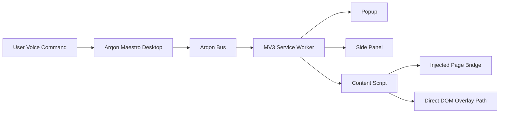
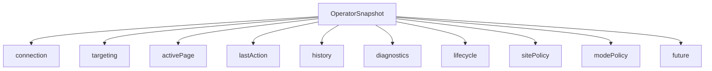
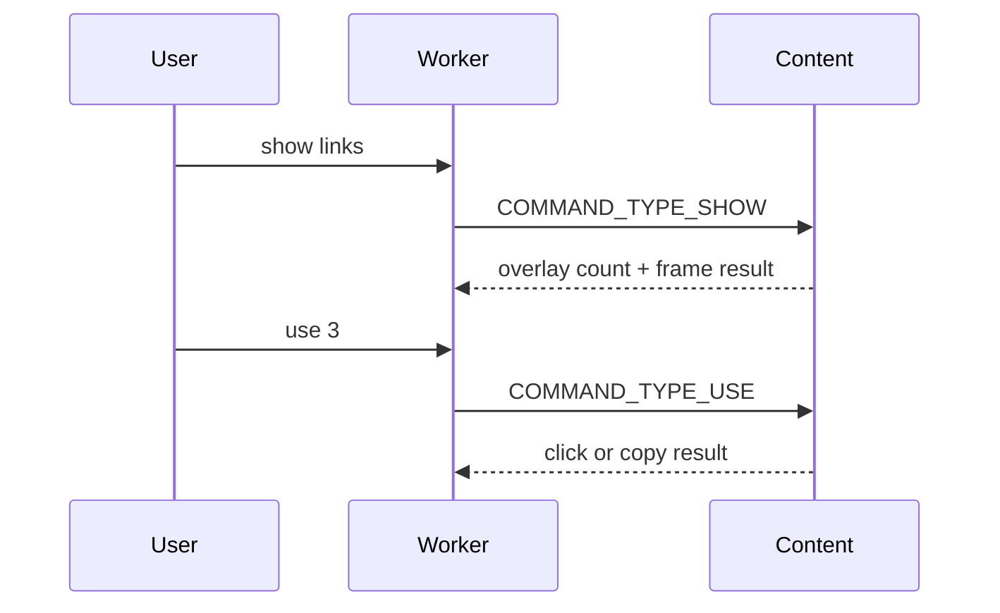

# Arqon Maestro Chrome Extension Tech Note

## Purpose

This document is the engineering-facing technical note for the Arqon Maestro Chrome Extension. It is intended to provide:

- the big-picture system model
- the current extension architecture
- the supported runtime behavior
- the release-facing command surface
- the policy and safety model
- the known compatibility boundaries
- the concrete file locations where the system is implemented

This note is deliberately more detailed than the public-facing docs. It is designed to be useful to maintainers, reviewers, and future extension engineers.

## Executive Summary

The Arqon Maestro Chrome Extension is a Manifest V3 browser control surface for the local Arqon Maestro stack.

At a high level:

- the Chrome extension is the browser-resident control layer
- Arqon Bus is the local WebSocket transport
- the Arqon Maestro desktop app is the voice and orchestration runtime
- the extension executes browser commands, renders overlays, surfaces diagnostics, and exposes an operator UI through a popup and side panel

The current release posture is:

- Chrome-first public beta
- conservative on sensitive domains
- explicit about degraded and compatibility-routed behavior
- oriented toward operator trust and diagnosability rather than invisible automation

## System Boundaries

The extension is not the full voice system. It is one component in a local stack:

1. Arqon Maestro desktop receives and interprets spoken commands
2. Arqon Bus provides the local message transport
3. the extension service worker receives command payloads and routes them
4. content scripts and injected scripts act on the active browser page where needed

### Architecture Overview

Caption: High-level runtime flow from voice input to browser execution and operator surfaces.

## Major Runtime Surfaces

The extension has four major runtime surfaces.

| Surface | Role | Primary file locations |
|---|---|---|
| Service worker | connection, command dispatch, snapshot state, lifecycle, policy | `src/extension.ts`, `src/ipc.ts` |
| Content script | direct page interaction, overlays, page analysis | `src/content-script.ts` |
| Injected page bridge | legacy or page-world-only commands | `src/injected.ts`, `src/injected-command-handler.ts` |
| Operator UI | popup and side panel | `src/popup.ts`, `src/sidepanel.ts` |

Caption: The extension is intentionally split by responsibility rather than keeping logic in a single background script.

## Code Map

These are the critical files to understand first.

| File | Responsibility |
|---|---|
| `manifest.json` | MV3 manifest, permissions, content script registration, side panel registration |
| `src/extension.ts` | service worker entrypoint, runtime message handlers, lifecycle glue, overlay policy orchestration |
| `src/ipc.ts` | Bus connection management, command routing, operator snapshot, history, policy enforcement |
| `src/extension-command-handler.ts` | Chrome API-backed commands such as tabs and reload |
| `src/content-script.ts` | page analysis, direct overlay rendering, direct command handling |
| `src/injected.ts` | injected-page event bridge |
| `src/injected-command-handler.ts` | page-world-only or legacy command execution |
| `src/operator-snapshot.ts` | canonical runtime data model shared by popup and side panel |
| `src/command-capabilities.ts` | declared command capability registry |
| `src/sensitive-url.ts` | sensitive-page URL detection |
| `src/popup.ts` | popup data fetch, rendering, mode control, reconnect control |
| `src/sidepanel.ts` | side panel rendering, diagnostics, ledger, policy preview |
| `src/editors.ts` | editor integrations for native inputs, Ace, CodeMirror, Monaco |

## Manifest and Permission Model

Current MV3 manifest characteristics:

- Manifest version: 3
- service worker background
- content scripts on `*://*/*`
- host permissions on `*://*/*`
- side panel enabled
- `web_accessible_resources` for injected page assets

Current permissions:

- `background`
- `tabs`
- `storage`
- `alarms`
- `idle`
- `scripting`
- `webNavigation`
- `sidePanel`

Current host permissions:

- `*://*/*`

Why broad host permissions exist:

- the supported command surface is intentionally browser-wide across the user’s active Chrome pages
- overlays, page analysis, and page interaction cannot be limited to a small fixed site list
- `activeTab` alone is not sufficient for the current operator model because the extension must remain aware of active-page state and re-apply scoped policy on the current tab

## Operator Snapshot Model

The service worker owns a canonical operator snapshot, defined in `src/operator-snapshot.ts`.

It includes:

- connection state
- targeting state
- active page intelligence
- last action
- execution history
- diagnostics
- lifecycle history
- site policy preview
- future feature seams
- requested mode and effective mode

### Snapshot Structure

Caption: The operator snapshot is the single source of truth for popup and side panel rendering.

### Why the Snapshot Exists

Before V2, the extension relied on scattered state and ad hoc debug helpers. The snapshot model was introduced to:

- make popup and side panel consume the same runtime state
- preserve diagnosability after cold starts and reconnects
- distinguish user-facing actions from internal support traffic
- expose effective policy rather than only stored preference

## Command Routing Model

The extension uses four route classes:

| Route | Meaning | Example |
|---|---|---|
| `extension-worker` | browser command executed directly with Chrome APIs | tab commands |
| `content-script-direct` | direct content-script path for page interaction | `show links`, `use <n>`, `cancel` |
| `injected` | legacy or page-world-only path | selector commands, editor-heavy experimental commands |
| `browser-nav-compat` | compatibility-routed browser navigation path | `go to <site>`, `open <site>` |

The route is captured in command traces so that a command is not just “success” or “failure”; the system also reports how the command was executed.

## Capability Registry

The command capability registry in `src/command-capabilities.ts` classifies commands by:

- type
- label
- category
- route
- support level
- note
- legacy flag

Support levels:

- `stable`
- `compatibility`
- `experimental`

This registry is used to keep public claims aligned with the real runtime.

## Supported Public Beta Command Surface

The current production-supported command set is intentionally smaller than the extension’s full internal capability surface.

### Supported user-facing commands

| Command family | Notes |
|---|---|
| `show links` | stable |
| `show inputs` | stable |
| `show code` | stable |
| `use <n>` | stable, subject to overlay lifetime and page policy |
| `cancel` | stable |
| `next tab` / `previous tab` / `switch tab <n>` | stable |
| `close tab` / `duplicate tab` / `reload` | stable |
| `back` / `forward` | stable |
| `go to <site>` / `open <site>` | compatibility-routed |

### Not promised by the public beta

| Area | Status |
|---|---|
| arbitrary click automation | not promised |
| broad editor mutation reliability | not promised |
| advanced semantic memory | deferred |
| teach mode | deferred |
| site profile authoring UI | deferred |
| full browser parity beyond Chrome | not promised |

Caption: The production contract is deliberately narrower than the total code surface in order to keep the beta honest.

## Overlay Model

The extension currently has two distinct overlay behaviors:

1. explicit overlays
   - user says `show links`, `show inputs`, or `show code`
   - overlays appear
   - user can say `use <n>` or `cancel`

2. overlay policy auto-show
   - per-tab policy only
   - auto-shows `show links`
   - explicitly does not mean a hidden `show all`

### Overlay Design Principles

- overlays are scoped to the current tab
- overlay spam across tabs and frames is not acceptable
- overlay selection expires after a timeout for normal explicit command mode
- on sensitive pages, auto-show overlays are blocked by policy

### Overlay Flow

Caption: The direct content-script overlay path is the primary stable inspection and selection path.

## Targeting and Frame Resolution

One of the main hardening tasks in V2 was to eliminate guesswork around tab and frame targeting.

The current resolution model uses:

- preferred tab memory
- active tab fallback
- last-focused window logic
- frame enumeration via `webNavigation`
- best responding frame selection

Target traces record:

- resolved tab id
- resolved frame id
- resolution state
- resolution source
- resolution reason

This was critical for fixing failures where a command succeeded on a different tab or frame than the user expected.

## Sensitive-Page Policy

Sensitive-page policy is one of the most important release-hardening behaviors in the extension.

Sensitive pages are detected from:

- hostname
- URL path
- query string

Patterns include login, auth, account, billing, payment, checkout, admin, oauth, and similar flows.

### Current sensitive-page behavior

| Behavior | Sensitive page policy |
|---|---|
| explicit `show links` | allowed |
| explicit `show inputs` | allowed |
| overlay auto-show policy | blocked |
| `use <n>` | blocked |
| mutating commands | blocked or degraded |
| operator posture | effective mode forced to `assist` |

The principle is:

- help the user inspect and understand the page
- do not allow ambiguous or indirect automation on pages with higher consequence

## Requested Mode vs Effective Mode

The extension now distinguishes between:

- requested mode
- effective mode

Requested mode is the user’s stored preference:

- `observe`
- `assist`
- `pilot`
- `locked`

Effective mode is what actually applies on the current page after runtime policy is considered.

Example:

- requested mode: `pilot`
- current page: `accounts.google.com` sign-in
- effective mode: `assist`

This avoids a misleading UI where the user thinks `pilot` is active while the runtime is deliberately behaving conservatively.

## Popup and Side Panel

### Popup

The popup is the quick operator cockpit.

It is intended to answer:

- is the extension connected?
- what page is active?
- what is the effective mode?
- what was the last action?
- is overlay auto-show enabled on this tab?

Primary implementation files:

- `src/popup.ts`
- `src/popup.html`
- `src/popup.css`

### Side panel

The side panel is the detailed operational surface.

It is intended to answer:

- what does the extension know about this page?
- what command just ran?
- what route was used?
- what policy is in effect?
- what diagnostics or lifecycle anomalies exist?

Primary implementation files:

- `src/sidepanel.ts`
- `src/sidepanel.html`
- `src/sidepanel.css`

## Diagnostics and Lifecycle

The extension deliberately exposes more runtime detail than a typical browser extension because the system depends on:

- a service worker
- a local Bus connection
- page analysis
- content-script injection
- tab and frame targeting

The diagnostics surface includes:

- Bus connected state
- WebSocket ready state
- last heartbeat
- target resolution
- content-script reachability
- analyze-page reachability
- page-context freshness
- reinjection counts
- lifecycle events

### Lifecycle events tracked

| Event kind | Meaning |
|---|---|
| `worker-start` | worker runtime initialized |
| `worker-wake` | worker became active again |
| `worker-connect` | Bus connection opened |
| `worker-disconnect` | Bus connection closed |
| `worker-backoff` | reconnect delay was scheduled |
| `worker-reconnect-attempt` | explicit reconnect attempt |
| `keepalive` | periodic heartbeat or watchdog activity |
| `page-context` | content script reported page context |
| `reinjection` | content script reinjection occurred |

## Content Script vs Injected Script

The extension currently uses both direct content-script logic and an injected-page bridge.

That is intentional, but asymmetrical:

- the direct content-script path is preferred for stable production commands
- the injected path remains only where page-world access or older compatibility logic still exists

### Production preference

| Path | Release posture |
|---|---|
| direct content-script | preferred |
| extension-worker | preferred for browser commands |
| browser-nav compatibility | acceptable but explicitly labeled |
| injected-page | retained only where necessary, not preferred |

This is why compatibility and experimental commands are surfaced honestly in the ledger rather than being presented as equal to stable commands.

## Known Compatibility Boundaries

The extension is strong, but it is not pretending to be a universal browser automation engine.

Known boundaries:

- compatibility-routed browser navigation still depends on Maestro’s command contract
- some injected selector and editor paths are still experimental
- broad host permissions may trigger slower Chrome Web Store review
- some support commands are internal and intentionally filtered from Last Action and the execution ledger
- overlay selection requires prompt follow-up because explicit overlays expire

## Release and Submission State

The extension is a strong public-beta candidate.

What is already in place:

- MV3 architecture
- popup and side panel
- operator snapshot
- route-aware execution ledger
- capability map
- sensitive-page policy
- requested vs effective mode display
- Chrome Web Store listing docs
- privacy policy docs
- screenshot set and icon set

What still matters operationally before or during release:

| Area | Status |
|---|---|
| Chrome Web Store submission review | external, pending reviewer outcome |
| Maestro-side parser/contract expansion for additional browser phrases | deferred |
| advanced features like Teach Mode, Dry Run, Session Memory | deferred |

## Documentation Map

These docs complement this TechNote:

| Document | Purpose | Location |
|---|---|---|
| Supported Commands | public production command surface | `docs/SUPPORTED_COMMANDS.md` |
| Production Readiness Checklist | release gate checklist | `docs/PRODUCTION_READINESS_CHECKLIST.md` |
| Command QA Matrix | command-by-command execution evidence | `docs/COMMAND_QA_MATRIX.md` |
| Site Compatibility Sweep | site class support evaluation | `docs/SITE_COMPATIBILITY_SWEEP.md` |
| Troubleshooting | operational recovery and diagnostics | `docs/TROUBLESHOOTING.md` |
| Technical Specification | architecture and product specification | `docs/SPEC.md` |
| Implementation Plan | phased implementation view | `docs/IMPLEMENTATION_PLAN.md` |
| Chrome Web Store Listing | release listing copy and assets | `docs/CHROME_WEB_STORE_LISTING.md` |
| Privacy Policy | extension privacy policy text | `docs/PRIVACY_POLICY.md` |

Caption: This TechNote is the engineering synthesis layer across the rest of the documentation set.

## Recommended Maintenance Rules

When changing this extension, keep these rules:

1. public claims must stay aligned with `docs/SUPPORTED_COMMANDS.md`
2. new commands must be classified in `src/command-capabilities.ts`
3. user-facing diagnostics must not be polluted by internal support commands
4. sensitive-page behavior must stay conservative unless deliberately changed
5. requested mode and effective mode must not be conflated in the UI
6. popup and side panel should only render from the operator snapshot
7. compatibility behavior must stay visible, not hidden

## Future Work

The extension has seams for future features but does not yet claim them as release behavior:

- Teach Mode
- site profile authoring
- Dry Run / Preview
- semantic memory
- stronger mode enforcement beyond the current safety posture

These are already represented in the snapshot model so they can be added without another architectural rewrite.

## Final Note

The extension has crossed the line from “legacy rescue project” into a coherent MV3 browser control runtime. The key remaining risks are not architectural confusion anymore; they are release discipline, review outcomes, and the pacing of future capability expansion.
