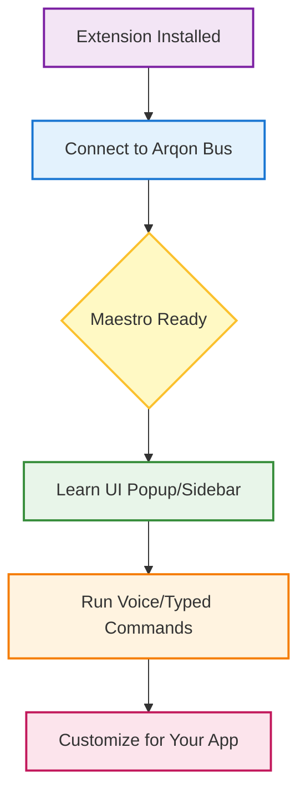

# 🚀 The Ultimate Getting Started Guide

Welcome to **Arqon Maestro**, your voice-first control layer for the browser. This guide is designed for first-time users and novices who want to master Maestro from scratch.

---

## 🗺️ The Big Picture

Maestro works as a bridge between your voice (or commands) and the browser's interface. Here's a high-level overview of how you'll interact with it:



---

## 🛠️ Step 1: Force Connection to Arqon Bus

Before you can control the browser, Maestro needs to talk to the **Arqon Bus**.

> [!TIP]
> Make sure your Arqon Maestro desktop app is running in the background before starting.

1.  **Open Chrome Extensions**: Go to `chrome://extensions`.
2.  **Enable Developer Mode**: Toggle the switch in the top-right corner.
3.  **Load Extension**: Click **Load unpacked** and select the extension's build folder.
4.  **Pin the Extension**: Click the puzzle icon 🧩 in the Chrome toolbar and pin **Maestro**.
5.  **Verify Status**: Click the Maestro icon. You should see a **green dot** stating `Connected to Arqon Bus`.

---

## 🖥️ Step 2: Master the Interface

Maestro has two main ways to talk to you: the **Popup** and the **Side Panel**.

### The Popup (Quick Control)
The popup is for fast actions and status checks.
- **Status Dot**: Green (Connected), Red (Disconnected).
- **Settings**: Toggle "Always Show Clickables" if you want to see markers constantly.
- **Side Panel Toggle**: Click this to open the advanced view.

### The Side Panel (Command Center)
This is where the magic happens. Use `Alt+S` (or your OS equivalent) to open it.

| Feature | Description | Use Case |
| :--- | :--- | :--- |
| **Capability Map** | Shows what Maestro can currently do on this page. | Discovering new voice commands. |
| **Execution Ledger** | A live log of every command you run. | Debugging why a command didn't work. |
| **Diagnostics** | Technical health of the extension. | Troubleshooting performance. |

---

## 🗣️ Step 3: Your First Commands

Don't be shy! Try these commands once the extension is connected.

| Command | What it does |
| :--- | :--- |
| `show links` | Puts numbered markers over every link on the page. |
| `click 1` | Simulates a click on the element marked with #1. |
| `show inputs` | Highlights every text field and checkbox. |
| `scroll down` | Smoothly moves the page down. |
| `copy code` | Identifies code blocks and copies the contents for you. |

---

## 🛠️ Advanced: Customizing for Your App

Are you a developer? You can make your React SPA or browser app "Maestro-friendly" with zero effort.

### 🛡️ Use Semantic HTML
Maestro is smart, but it loves clean code. Use standard tags:
```html
<!-- ✅ GOOD: Maestro knows this is a button -->
<button>Submit</button>

<!-- ❌ BAD: Maestro might miss this -->
<div class="my-custom-btn">Submit</div>
```

### 🏷️ ARIA Roles
If you *must* use custom elements, give them a role:
```html
<div role="button" aria-label="Click me">Custom Button</div>
```

### 🧪 Target Selection
Maestro identifies "Editor" pages (like VS Code Web) by looking for classes like `.monaco-editor` or `.CodeMirror`. If your app uses these, Maestro will automatically enable "Editor Mode".

---

> [!IMPORTANT]
> **Need Help?**
> If the status dot is red, try restarting the Arqon Maestro desktop app and clicking **Reconnect** in the popup.
